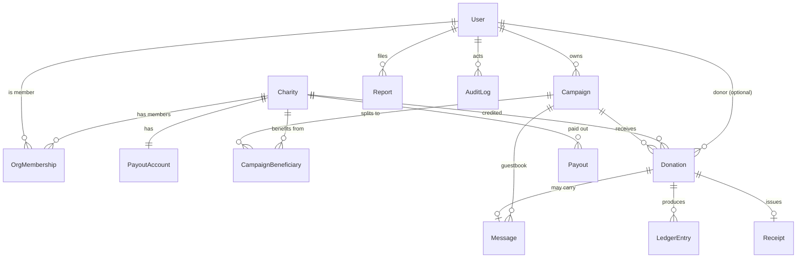

# Schema Design — from single-couple prototype to multi-tenant giving platform

Status: **proposal for review.** No code/migrations written yet. This is the
contract the `models.py` + migrations will implement once you've committed your
current WIP.

---

## 1. Principles (the non-negotiables this schema encodes)

1. **Money can only reach a *verified* `Charity`.** No payouts to individuals in v1.
2. **Never store raw bank data.** Payout identity lives in Stripe; we store only a
   `stripe_account_id` + capability flags.
3. **The ledger is the source of truth for money.** Donation rows are convenient;
   `LedgerEntry` rows are immutable and reconcilable against Stripe.
4. **All public UGC is moderatable.** Messages are first-class objects with a
   moderation state, not a free-text column.
5. **Tenancy is row-level** (`owner_id` / `charity_id` on every tenant-owned row),
   enforced by a scoping manager — never schema-per-tenant.
6. **Migrations are additive-then-tighten.** The app keeps working at every step.

---

## 2. Entity-relationship overview



Conceptual note: **`Charity` *is* the "Organization" tenant** in v1 — I keep the
name `Charity` to avoid renaming a live table + the `AddCharity`/`EditCharity`/
`ManageCharities` frontend. Split them only if an umbrella org ever runs multiple
programs (phase 2+).

---

## 3. Entity catalog

### 3.1 Identity & tenancy

**User** — Django's built-in `auth.User`, unchanged. Roles derived from:
`is_staff`/`is_superuser` (platform), `OrgMembership.role` (charity), and
`Campaign.owner`/cohosts (host). No custom user model (not worth the migration risk).

**OrgMembership** *(new)* — who can act for a charity.
| field | type | notes |
|---|---|---|
| user | FK→User | |
| charity | FK→Charity | |
| role | char choices | `owner` / `admin` / `finance` / `editor` |
| created_at | datetime | auto |
| | | **unique_together (user, charity)** |

### 3.2 Charity (the tenant) — *extend existing model*

Existing fields kept: `name`, `description`, `website`, `logo`.
New fields (all nullable/defaulted so the migration is additive):
| field | type | notes |
|---|---|---|
| slug | slug, unique | backfilled from `name` |
| country | char(2) | ISO; drives which registry verifies it |
| registration_number | char, blank | charity register ID |
| verification_status | char choices | `unverified`(default)/`pending`/`verified`/`rejected`/`suspended` |
| verified_at | datetime, null | |
| contact_email | email, blank | ops contact, never public |
| is_active | bool, default True | soft-disable without delete |

**PayoutAccount** *(new, 1–1 Charity)* — **no bank data here.**
| field | type | notes |
|---|---|---|
| charity | OneToOne→Charity | |
| stripe_account_id | char, unique | Connect account |
| charges_enabled | bool | from Stripe |
| payouts_enabled | bool | from Stripe |
| details_submitted | bool | KYC done? gate "publish" on this |
| updated_at | datetime | synced from webhook |

### 3.3 Campaign (generalizes the "couple")

This is what today's empty `Profile` becomes — an event that collects donations.
**Campaign** *(new)*
| field | type | notes |
|---|---|---|
| owner | FK→User | the host |
| cohosts | M2M→User, blank | co-organizers (content only, no money power) |
| type | char choices | `wedding`/`birthday`/`memorial`/`anniversary`/`general` |
| title | char | "Anna & Alan's Wedding" |
| slug | slug, unique | vanity URL |
| story | text, blank | rich description |
| cover_image | image, null | Cloudinary |
| event_date | date, null | replaces `Profile.wedding_date` |
| location | char, blank | from `Profile.location` |
| goal_amount | decimal, null | optional target |
| currency | char(3), default `EUR` | |
| visibility | char choices | `public`/`unlisted`/`private` |
| status | char choices | `draft`/`active`/`closed` |
| created_at / updated_at | datetime | |

**CampaignBeneficiary** *(new)* — which charities a campaign funds, with splits.
| field | type | notes |
|---|---|---|
| campaign | FK→Campaign | |
| charity | FK→Charity | must be `verified` to publish |
| split_percent | decimal, default 100 | sum per campaign ≤ 100 (validated) |
| | | **unique_together (campaign, charity)** |

> v1 UI can be single-charity; the model supports multi-charity splits so you
> don't re-migrate later. **Tradeoff:** a little unused flexibility now vs. a
> painful schema change after launch.

### 3.4 Donation — *extend existing model*

Existing kept: `user`(FK null), `charity`(FK), `donor_name`, `donor_email`,
`amount`, `status`, `created_at`, `updated_at`. The free-text `message` is
**copied into `Message` then deprecated** (kept as a column through the transition).
New fields:
| field | type | notes |
|---|---|---|
| campaign | FK→Campaign, null→required | nullable during backfill, then NOT NULL |
| currency | char(3), default `EUR` | |
| stripe_payment_intent_id | char, unique, null | idempotency anchor |
| platform_fee | decimal, default 0 | what we keep |
| stripe_fee | decimal, default 0 | processor cost |
| net_amount | decimal, null | to the charity |
| is_anonymous | bool, default False | hide donor identity publicly |
| status | char choices | add `refunded`; keep lowercase `pending/confirmed/failed` |

Indexes: `(campaign, status)`, `(charity, status)`, `created_at`,
unique `stripe_payment_intent_id`.

### 3.5 Money: ledger, receipts, payouts

**LedgerEntry** *(new, append-only)* — the reconciliation backbone.
| field | type | notes |
|---|---|---|
| donation | FK→Donation, null | null for non-donation entries |
| entry_type | char choices | `donation_received`/`platform_fee`/`stripe_fee`/`payout`/`refund` |
| account | char choices | `charity`/`platform`/`stripe` |
| amount | decimal | signed |
| currency | char(3) | |
| created_at | datetime | **rows are never updated or deleted** |

**Receipt** *(new, 1–1 Donation)** — `number`(unique), `pdf_url`, `tax_year`,
`issued_at`. Generated async via the outbox on payment success.

**Payout** *(new)** — mirror of Stripe payouts for ops visibility:
`charity`, `stripe_payout_id`, `amount`, `currency`, `status`, `arrival_date`.

### 3.6 Messages (guestbook) — *extract from `Donation.message`*

**Message** *(new)* — your social-proof engine, now moderatable.
| field | type | notes |
|---|---|---|
| campaign | FK→Campaign | |
| donation | FK→Donation, null | null = standalone message |
| display_name | char | from `donor_name` |
| body | text | |
| is_anonymous | bool, default False | |
| moderation_status | char choices | `pending`/`approved`/`auto_approved`/`rejected` |
| moderation_score | float, null | from automated check |
| created_at / published_at | datetime | |

Index: `(campaign, moderation_status, published_at)`.
The frontend guestbook switches from `fetch('/data/donations.csv')` →
`GET /api/messages/?campaign=<slug>&status=approved`.

### 3.7 Trust, safety & ops

**Report** *(new)* — user flags on any content (generic FK):
`reporter`(null), `content_type`+`object_id`, `reason`, `status`
(`open`/`reviewed`/`actioned`/`dismissed`), `created_at`.

**AuditLog** *(new, append-only)* — every money/role/moderation action:
`actor`(null), `action`, `target_type`, `target_id`, `metadata`(JSON), `ip`,
`created_at`. This is what makes money disputes debuggable.

### 3.8 Reliability

**OutboxEvent** *(new)* — written in the **same transaction** as the donation;
drained by a worker/Lambda. Powers reliable receipts, emails, webhooks.
| field | type | notes |
|---|---|---|
| event_type | char | e.g. `donation.succeeded` |
| payload | JSON | |
| status | char choices | `pending`/`processing`/`done`/`failed` |
| attempts | int, default 0 | |
| created_at / processed_at | datetime | |

---

## 4. Tenancy & permission model

- **Scoping manager mixin:** tenant-owned models (`Campaign`, `Donation`,
  `Message`) get `.for_user(user)` returning only rows the user may see
  (host → own campaigns; charity member → donations crediting their charity;
  platform staff → all). Enforce in DRF `get_queryset`, not just serializers.
- **Roles → powers** (separate *content* power from *money* power):

| Role | Content | Money | Moderation | Platform |
|---|---|---|---|---|
| Donor | own messages | own donations/receipts | — | — |
| Host / Cohost | own campaign + guestbook | view only | hide on own page | — |
| Charity `editor` | charity profile/campaigns | — | — | — |
| Charity `finance` | — | view payouts/reports | — | — |
| Charity `owner`/`admin` | charity profile + members | connect payouts | — | — |
| Moderator | — | — | global | — |
| Platform admin | all | refunds, reconcile | global | all (2FA + audited) |

---

## 5. Migration strategy (phased, reversible, app stays up)

Current DB: **3 charities, 28 donations, 0 profiles**, migrations 0001–0006 applied.

**Phase A — additive (zero data risk):** create all new models; add new
*nullable/defaulted* fields to `Charity` and `Donation`. Nothing removed. App
unaffected.

**Phase B — backfill (data migration):**
1. Create the **flagship `Campaign`** ("Anna & Alan's Wedding", type=`wedding`,
   status=`active`) — sourced from the signal defaults/CSV since `Profile` is empty.
2. Set `Donation.campaign = flagship` for all 28 rows.
3. Backfill `Charity.slug` from `name`; set the 3 launch charities to
   `verification_status='verified'` (they're your curated launch set).
4. Copy each `Donation.message` → a `Message` row (`moderation_status='approved'`,
   `display_name=donor_name`).

**Phase C — tighten:**
5. Make `Donation.campaign` NOT NULL (safe after step 2).
6. **Retire `Profile`:** move its display bits (bride/groom/date/bio/location/
   picture) conceptually into `Campaign`; **delete `bank_name`, `account_number`,
   `revolut_username`.** Because `Profile` has 0 rows this is code-only — but
   [Profile.jsx](love_frontend/src/components/Profile.jsx) + `ProfileSerializer` +
   `public_profile` must change in the same PR or the form 400s.

**Phase D — Stripe cutover (separate deliverable):** wire `PaymentIntent` →
`stripe_payment_intent_id`, status from webhook, `LedgerEntry` on success,
`Receipt` via outbox. Donations stop being "admin-confirmed" and become
"payment-confirmed."

Each phase is its own migration file and is independently revertible.

---

## 6. Open decisions (need your call before I write models)

1. **Keep `Charity` as the tenant name** (vs. rename to `Organization`)?
   → Recommend **keep** (less churn).
2. **Extract `Message` from `Donation.message`** now (vs. keep free-text)?
   → Recommend **extract** (moderation needs an object); keep old column during transition.
3. **Retire `Profile` into `Campaign` in this pass** (vs. leave `Profile` for later)?
   → Recommend **retire now** — it's empty, and it removes the bank fields, which
   is the single biggest compliance win. Costs a `Profile.jsx` rewrite.
4. **Multi-charity campaign splits** modelled now (vs. single-charity only)?
   → Recommend **model now, single-charity UI** for v1.
```
